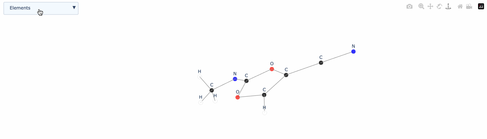

# xyz2graph

[](https://pypi.org/project/xyz2graph/)
[](https://pypi.org/project/xyz2graph/)
[](https://github.com/zotko/xyz2graph/blob/master/LICENSE)

[](https://pepy.tech/projects/xyz2graph)


A lightweight Python package for reading XYZ files and creating interactive molecular visualizations. Convert molecular structures into 3D visualizations using Plotly or analyze them as NetworkX graphs.

<p align="center">
  
</p>

## Features

- Read and parse XYZ molecular structure files
- Generate interactive 3D molecular visualizations using Plotly
- Convert molecular structures to NetworkX graphs for analysis
- Command-line interface for quick visualizations

## Installation

```bash
pip install xyz2graph
```


## Requirements

- Python 3.8+
- NumPy
- NetworkX
- Plotly

## Usage

### Python API

```python
from xyz2graph import MolGraph
from plotly.offline import plot

# Create molecular graph and read XYZ file
mg = MolGraph()
mg.read_xyz('molecule.xyz')

# Generate interactive 3D visualization
fig = mg.to_plotly()
plot(fig)

# Convert to NetworkX graph for analysis
G = mg.to_networkx()
```

### Jupyter Notebook

```python
from xyz2graph import MolGraph
from plotly.offline import init_notebook_mode, iplot

# Initialize Plotly for notebook
init_notebook_mode(connected=True)

# Create and display molecular visualization
mg = MolGraph()
mg.read_xyz('molecule.xyz')
iplot(mg.to_plotly())
```

### Command Line Interface

Quickly visualize molecules from XYZ files:

```bash
# Save visualization as HTML
xyz2graph molecule.xyz

# Specify output file
xyz2graph molecule.xyz --output visualization.html

# Open directly in browser
xyz2graph molecule.xyz --browser
```

## Customization

Customize atomic properties for visualization:

```python
mg = MolGraph()

# Customize atomic radius
mg.set_element_radius('C', 0.75)

# Customize element color
mg.set_element_color('O', 'red')

# Set default color for unlisted elements
mg.set_default_color('pink')
```

## Examples

Example XYZ files can be found in the [`examples`](examples/) directory.

## Contributing

Contributions are welcome! Please feel free to submit a Pull Request.

## License

This project is licensed under the MIT License - see the LICENSE file for details.
