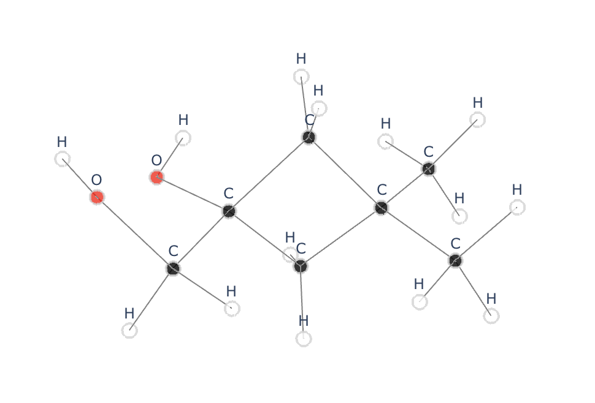

# xyz2graph

[**xyz2graph**](https://github.com/zotko/xyz2graph) is a Python package for reading of .xyz files and creating of molecular graphs from atomic coordinates. The molecular graph can be converted into [NetworkX](https://networkx.github.io) graph or [Plotly](https://plot.ly) figure for 3D visualization in a browser window or in a [Jupyter notebook](https://jupyter.org).

  

